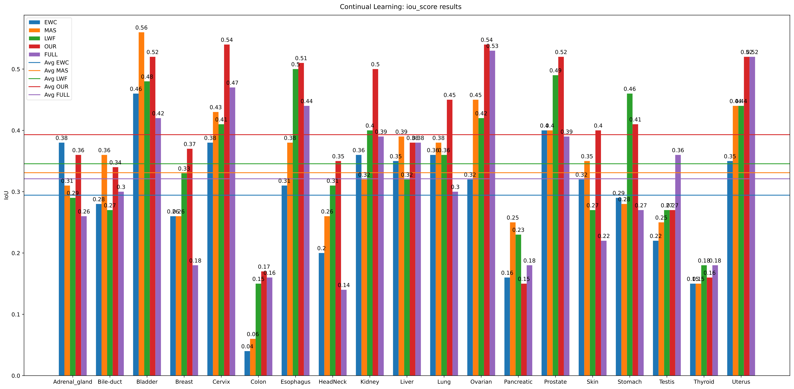
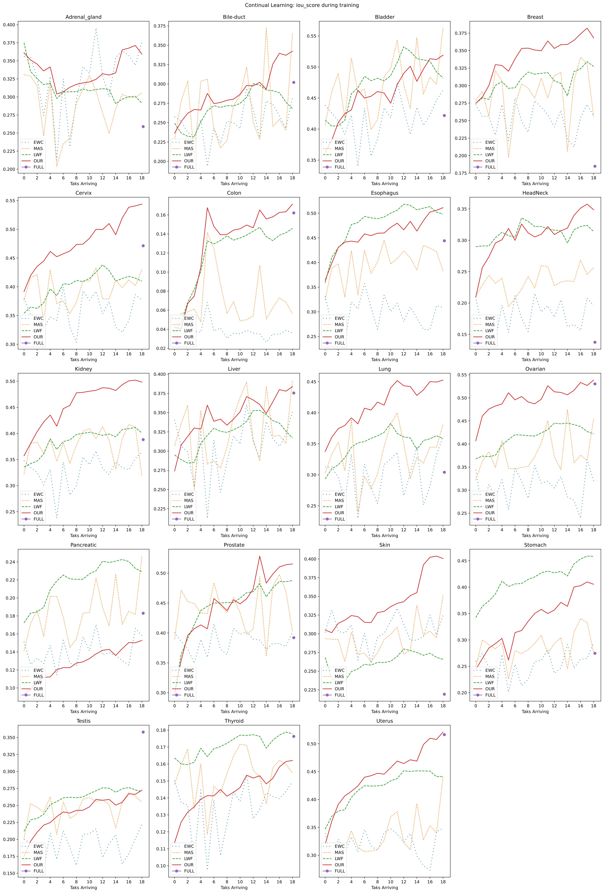
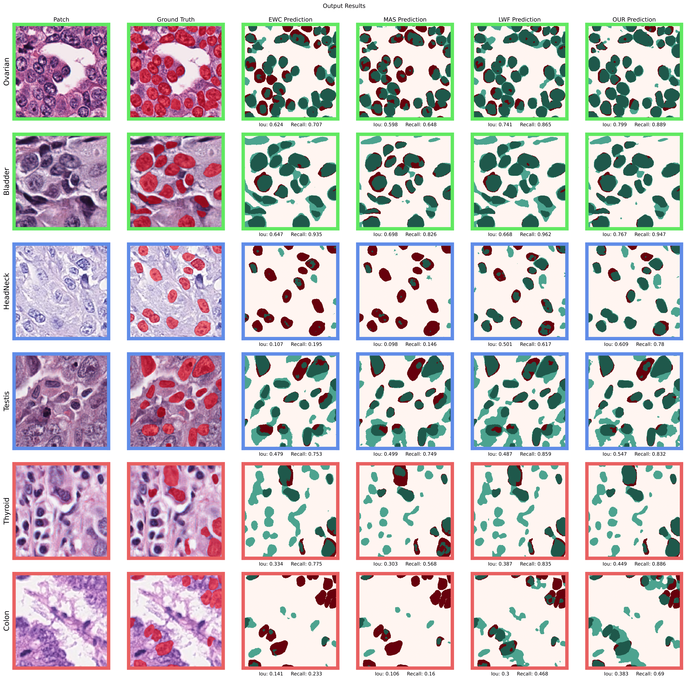

# Continual Learning

Model Evaluation
```
nohup python nms.py ResultsReconstructed5/ ResultsReconstructedCSV5/ > outnms.out
nohup python Evaluation_FROC.py converted_mask_testing_images/ ResultsReconstructedCSV5/ > outfroc.out
```

## Results

### Final Metrics



### Training Process



### Final Outputs

