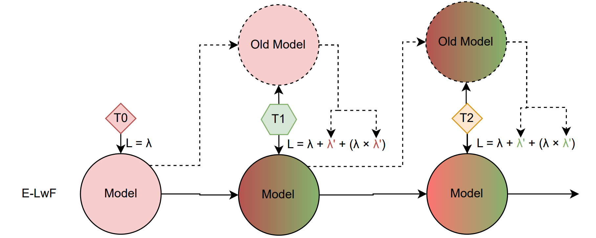
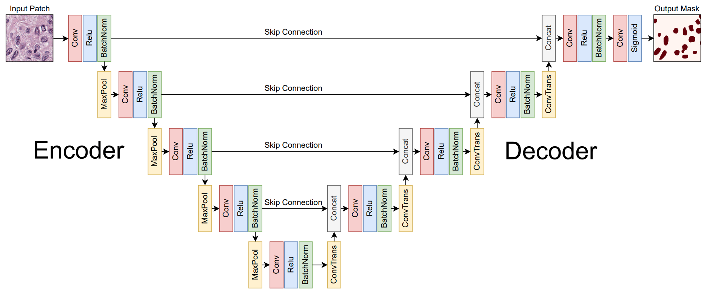

# cnn-dosimetry

This repo contains the code of:

- A Continual Learning framework (Enhanced LwF)
- A 2D CNN model to perform tumor segmentation on 2D pathology tissue slides (CPATH)
- A 3D CNN model to perform tumor segmentation on 3D computed tomography scans (CT)

## Continual Learning

Generalization capacity of LwF was improved using Knowledge Distillation to ease the optimization ug-of-war

## 2D CNN for CPATH

Model converged and generalized with sucess over 19 datasets

## 3D CNN for CT

The dataset contains too much annotation error and is too small, the model fails to converge

